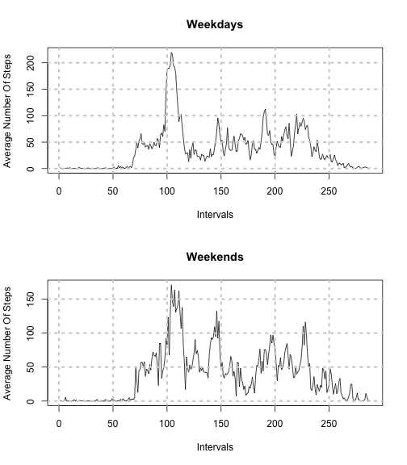

# Reproducable Research: Course Project 1 

## Introduction

It is now possible to collect a large amount of data about personal movement using activity monitoring devices such as a Fitbit, Nike Fuelband, or Jawbone Up. These type of devices are part of the “quantified self” movement – a group of enthusiasts who take measurements about themselves regularly to improve their health, to find patterns in their behavior, or because they are tech geeks. But these data remain under-utilized both because the raw data are hard to obtain and there is a lack of statistical methods and software for processing and interpreting the data.

This assignment makes use of data from a personal activity monitoring device. This device collects data at 5 minute intervals through out the day. The data consists of two months of data from an anonymous individual collected during the months of October and November, 2012 and include the number of steps taken in 5 minute intervals each day.

## Data 

The data for this assignment can be downloaded from the course web site:

Dataset: [Activity monitoring data](https://d396qusza40orc.cloudfront.net/repdata%2Fdata%2Factivity.zip) [52K]
The variables included in this dataset are:

steps: Number of steps taking in a 5-minute interval (missing values are coded as NA)

date: The date on which the measurement was taken in YYYY-MM-DD format

interval: Identifier for the 5-minute interval in which measurement was taken

The dataset is stored in a comma-separated-value (CSV) file and there are a total of 17,568 observations in this dataset.

## Assignment


```r
#If you dont have the following libraries then kindly install them before 
    library(seqinr)
    library(data.table)
    library(timeDate)
```

### Loading and preprocessing the data
Show any code that is needed to
1) Load the data (i.e. read.csv())
2) Process/transform the data (if necessary) into a format suitable for your analysis
    

```r
# Download the zip file in your working directory and unzip it in R by this code. 
unzip("repdata_data_activity.zip", exdir=".")
```

```
## Warning: error 1 in extracting from zip file
```

```r
#Load the data (i.e. read.csv())
#Process/transform the data (if necessary) into a format suitable for the analysis
data <- read.csv("activity.csv",header=TRUE,sep=",",na.strings="NA")
new_data <- data[!is.na(data),]
```

### What is mean total number of steps taken per day?

For this part of the assignment, you can ignore the missing values in the dataset.
    
1) Calculate and report the mean and median total number of steps taken per day


```r
#Calculating Sum of all steps taken day wise 
factored_data <- transform(new_data,date=factor(date))
split_data <- split(new_data,new_data$date)
total_steps <- sapply(split_data,function(x) sum(x[,"steps"]))
#Calculate and report the mean and median total number of steps taken per day
mean <- mean(total_steps)
median <- median(total_steps)
```

The mean of total number of steps taken per day is: 9354.2295
Median of total number of steps taken per day is : 10395

2) Make a histogram of the total number of steps taken each day

The histogram of total number of steps taken each day is:


```r
#Make a histogram of the total number of steps taken each day
hist_plot <- histogram(total_steps,type=c("count"),col=2,xlab="Total Steps",main="Total Number Of Steps Each Day")
```

```
## Error: could not find function "histogram"
```

```r
hist_plot
```

```
## Error: object 'hist_plot' not found
```


### What is the average daily activity pattern?

1) Make a time series plot (i.e. type = "l") of the 5-minute interval (x-axis) and the average             number of steps taken, averaged across all days (y-axis)
    
The plot of  5-minute interval (x-axis) and the average number of steps taken, averaged across all days (y-axis) is:


```r
par(bg="white")
factored_data <- transform(new_data,interval=factor(interval))
split_data <- split(new_data,new_data$interval)
average_data <- sapply(split_data,function(x) mean(x[,"steps"]))
plot(unlist(average_data),type="l",ylab="Average Steps",xlab="Intervals")
grid(lwd=3)
title("Average Steps Across Days In The Intervals")
```

 

2) Which 5-minute interval, on average across all the days in the dataset, contains the maximum number of steps?


```r
max_step_interval=which.max(average_data)
```

The 5-minute interval, on average across all the days in the dataset containing the maximum number of steps is : 104

### Imputing missing values

Note that there are a number of days/intervals where there are missing values (coded as NA). The presence of missing days may introduce bias into some calculations or summaries of the data.

1) Calculate and report the total number of missing values in the dataset (i.e. the total number of rows with NAs)


```r
num_NA <- dim(data[is.na(data),])[1]
```

The total number of missing values in the dataset are : 2304

2) Devise a strategy for filling in all of the missing values in the dataset. The strategy does not need to be sophisticated. For example, you could use the mean/median for that day, or the mean for that 5-minute interval, etc.


```r
a <- apply(data[is.na(data),],1,function(x) average_data[trimSpace(toString(x["interval"]),leading=TRUE,space=" ")])
```

3) Create a new dataset that is equal to the original dataset but with the missing data filled in.

New Data Set:

```r
    data[is.na(data),][,1] <- a
    print(head(data),type="html")
```

```
##     steps       date interval
## 1 1.71698 2012-10-01        0
## 2 0.33962 2012-10-01        5
## 3 0.13208 2012-10-01       10
## 4 0.15094 2012-10-01       15
## 5 0.07547 2012-10-01       20
## 6 2.09434 2012-10-01       25
```

4) Make a histogram of the total number of steps taken each day and Calculate and report the mean and median total number of steps taken per day. Do these values differ from the estimates from the first part of the assignment? What is the impact of imputing missing data on the estimates of the total daily number of steps?

The new histogram replacing the NA values in the old data is:


```r
#Calculating Sum of all steps taken day wise 
factored_data <- transform(data,date=factor(date))
split_data <- split(data,data$date)
total_steps <- sapply(split_data,function(x) sum(x[,"steps"]))
#Make a histogram of the total number of steps taken each day
hist_plot <- histogram(total_steps,type=c("count"),col=2,xlab="Total Steps",main="Total Number Of Steps Each Day")
```

```
## Error: could not find function "histogram"
```

```r
hist_plot
```

```
## Error: object 'hist_plot' not found
```


```r
#Calculate and report the mean and median total number of steps taken per day
new_mean <- mean(total_steps)
new_median <- median(total_steps)
```

New mean: 1.0766 &times; 10<sup>4</sup>
Old mean: 9354.2295

New median:1.0766 &times; 10<sup>4</sup>
Old median:10395

Both the new mean and new median are higher then the old mean and old median 

### Are there differences in activity patterns between weekdays and weekends?

For this part the weekdays() function may be of some help here. Use the dataset with the filled-in missing values for this part.

1) Create a new factor variable in the dataset with two levels – “weekday” and “weekend” indicating whether a given date is a weekday or weekend day.


```r
data <- data.table(data,keep.rownames=TRUE)
w<-sapply(data$date,function(x) if(isWeekday(as.POSIXct(x))==TRUE){"Weekday"}else{"Weekend"})
data[,Weekday_or_not:=w]
```

```
##           rn   steps       date interval Weekday_or_not
##     1:     1 1.71698 2012-10-01        0        Weekend
##     2:     2 0.33962 2012-10-01        5        Weekend
##     3:     3 0.13208 2012-10-01       10        Weekend
##     4:     4 0.15094 2012-10-01       15        Weekend
##     5:     5 0.07547 2012-10-01       20        Weekend
##    ---                                                 
## 17564: 17564 4.69811 2012-11-30     2335        Weekday
## 17565: 17565 3.30189 2012-11-30     2340        Weekday
## 17566: 17566 0.64151 2012-11-30     2345        Weekday
## 17567: 17567 0.22642 2012-11-30     2350        Weekday
## 17568: 17568 1.07547 2012-11-30     2355        Weekday
```

2) Make a panel plot containing a time series plot (i.e. type = "l") of the 5-minute interval (x-axis) and the average number of steps taken, averaged across all weekday days or weekend days (y-axis). 


```r
data <- transform(data,Weekday_or_not=factor(data$Weekday_or_not))
factored_data <- transform(data,interval=factor(interval))
split_data <- split(data,data$Weekday_or_not)
split_data_weekday_interval <- split(split_data[[1]],data$interval)
```

```
## Warning: data length is not a multiple of split variable
```

```r
split_data_weekend_interval <- split(split_data[[2]],data$interval)
```

```
## Warning: data length is not a multiple of split variable
```

```r
average_data_weekday <- sapply(split_data_weekday_interval,function(x) mean(x[,steps]))
average_data_weekend <- sapply(split_data_weekend_interval,function(x) mean(x[,steps]))
par(mfrow=c(2,1))
par(bg="white")
plot(unlist(average_data_weekday),type="l",ylab="Average Number Of Steps",xlab="Intervals",main="Weekdays")
grid(lwd=3)
plot(unlist(average_data_weekend),type="l",ylab="Average Number Of Steps",xlab="Intervals",main="Weekends")
grid(lwd=3)
```

 


